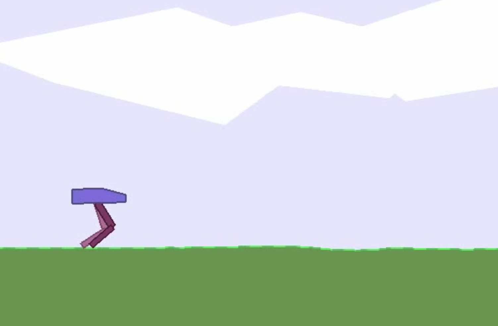

# Deep Reinforcement Learning
This is implemented to satisfy my personal interest to deep RL.

<!--  -->


DQN family [1-8] and SAC [9] [10] are implemented.


## Dependency
Python version is 3.6.4  
This depends on Pytorch and OpenAI Gym. 
Please see detail in requirements.txt.

## Usage

Evaluation example
```
python3 main.py evaluate --env mario --agent noisyDuelDQN --checkpoint data/noisyDuelDQN.chkpt
python3 main.py evaluate --env bipedal_walker --agent SAC --checkpoint data/SAC_5.chkpt
``` 

Training example
```
python3 main.py train --env mario --agent noisyDuelDQN
python3 main.py train --env bipedal_walker --agent SAC
``` 

Detail usage can be seen using following command.
```
python3 main.py -h
```

The combination of "env" and "agent" option is only allowed for the following pattern.
* env: bipedal_waler + agent: SAC
* env: mario + agent: the others


## References
[1] Mnih, Volodymyr, et al. "Playing atari with deep reinforcement learning." arXiv preprint arXiv:1312.5602 (2013).  
[2] Hasselt, Hado. "Double Q-learning." Advances in neural information processing systems 23 (2010): 2613-2621.  
[3] Van Hasselt, Hado, Arthur Guez, and David Silver. "Deep reinforcement learning with double q-learning." Proceedings of the AAAI conference on artificial intelligence. Vol. 30. No. 1. 2016.  
[4] Schaul, Tom, et al. "Prioritized experience replay." arXiv preprint arXiv:1511.05952 (2015).  
[5] Wang, Ziyu, et al. "Dueling network architectures for deep reinforcement learning." International conference on machine learning. PMLR, 2016.  
[6] Fortunato, Meire, et al. "Noisy networks for exploration." arXiv preprint arXiv:1706.10295 (2017).  
[7] Bellemare, Marc G., Will Dabney, and Rémi Munos. "A distributional perspective on reinforcement learning." International Conference on Machine Learning. PMLR, 2017.  
[8] Hessel, Matteo, et al. "Rainbow: Combining improvements in deep reinforcement learning." Thirty-second AAAI conference on artificial intelligence. 2018.  
[9] Haarnoja, Tuomas, et al. "Soft actor-critic: Off-policy maximum entropy deep reinforcement learning with a stochastic actor." International conference on machine learning. PMLR, 2018.  
[10] Haarnoja, Tuomas, et al. "Soft actor-critic algorithms and applications." arXiv preprint arXiv:1812.05905 (2018).  